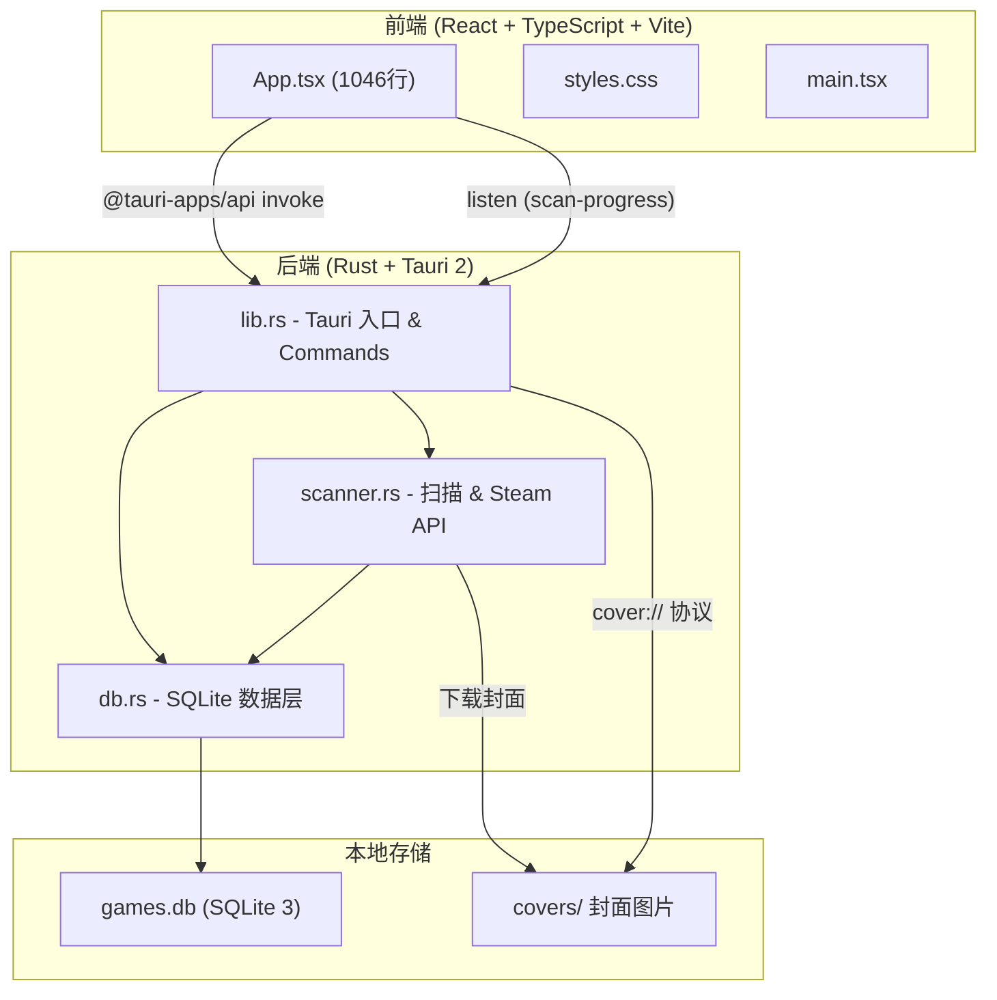

# 🏗️ GameIndex Tauri 架构审查报告

> [!NOTE]
> 项目已成功完成构建，生成可执行文件 `game-index.exe`。以下是对当前架构的全面评审和补充建议。

---

## 📊 当前架构总览



---

## ✅ 已完成的模块

| 模块 | 文件 | 状态 | 说明 |
|------|------|------|------|
| Tauri 配置 | src-tauri/tauri.conf.json | ✅ | 窗口、构建、打包配置 |
| Rust 依赖 | src-tauri/Cargo.toml | ✅ | rusqlite, reqwest, tokio 等 |
| 应用入口 | src-tauri/src/lib.rs | ✅ | 11 个 Tauri Commands + cover 协议 |
| 数据库层 | src-tauri/src/db.rs | ✅ | 4 张表 + CRUD + 统计查询 |
| 扫描引擎 | src-tauri/src/scanner.rs | ✅ | 目录扫描 + Steam API + 封面下载 |
| 前端界面 | src/App.tsx | ✅ | 7 个标签页 + 完整 UI |
| 样式系统 | src/styles.css | ✅ | 暗色主题 + glassmorphism |
| 前端构建 | vite.config.ts | ✅ | Vite + React 插件 |

---

## 🔍 需要补充和改进的地方

### 1. 🔴 **前端组件拆分 (高优先)**

当前 `App.tsx` 有 **1046 行**代码，所有视图和逻辑集中在单一文件中。建议拆分为独立组件：

```
src/
├── components/
│   ├── Header.tsx              # 顶栏 (标题 + 扫描按钮 + 设置)
│   ├── StatsGrid.tsx           # 统计面板 (4 张 stat-card)
│   ├── TabNav.tsx              # 标签栏导航
│   ├── FilterBar.tsx           # 搜索/筛选/排序控制栏
│   ├── Dashboard.tsx           # 系统首页内容
│   ├── PosterWall.tsx          # 海报墙 (平铺/详细视图)
│   ├── GameCard.tsx            # 单个海报卡片
│   ├── GameDetailRow.tsx       # 详细模式单行
│   ├── DuplicatesPanel.tsx     # 重复项面板
│   ├── FranchisesPanel.tsx     # 系列面板
│   ├── FullIndexPanel.tsx      # 完整索引表格
│   ├── SettingsPanel.tsx       # 盘库设置面板
│   ├── ScanProgress.tsx        # 扫描进度组件
│   └── Toast.tsx               # 提示消息组件
├── hooks/
│   ├── useGames.ts             # 游戏数据 hook
│   ├── useScan.ts              # 扫描逻辑 hook
│   └── useSettings.ts          # 配置读写 hook
├── types/
│   └── index.ts                # TypeScript 类型定义
├── utils/
│   └── helpers.ts              # 辅助函数 (评分颜色、封面URL等)
├── App.tsx                     # 精简后的主组件 (路由/布局)
├── main.tsx
└── styles.css
```

### 2. 🔴 **数据库连接管理 (高优先)**

当前每次 Tauri Command 调用都会重新打开一个 `Connection`：

```rust
// 当前实现 - 每次调用都新建连接
pub fn get_conn(_app_handle: &tauri::AppHandle) -> Result<Connection, String> {
    let path = get_db_path();
    Connection::open(path).map_err(|e| e.to_string())
}
```

建议使用 `Mutex<Connection>` 作为 Tauri State 管理全局连接：

```rust
use std::sync::Mutex;
use tauri::Manager;

pub struct DbState(pub Mutex<Connection>);

// 在 setup 中初始化
.setup(|app| {
    let conn = Connection::open(get_db_path())?;
    init_db(&conn)?;
    app.manage(DbState(Mutex::new(conn)));
    Ok(())
})

// Command 中使用
#[tauri::command]
fn get_games_stats_command(state: tauri::State<DbState>) -> Result<StatsSummary, String> {
    let conn = state.0.lock().map_err(|e| e.to_string())?;
    db::get_games_stats(&conn).map_err(|e| e.to_string())
}
```

### 3. 🟡 **错误处理增强 (中优先)**

当前所有错误都简单地用 `.map_err(|e| e.to_string())` 转换。建议引入统一的错误类型：

```rust
// src-tauri/src/error.rs
use serde::Serialize;

#[derive(Debug, Serialize)]
pub enum AppError {
    Database(String),
    Network(String),
    FileSystem(String),
    SteamApi(String),
}

impl std::fmt::Display for AppError {
    fn fmt(&self, f: &mut std::fmt::Formatter<'_>) -> std::fmt::Result {
        match self {
            AppError::Database(msg) => write!(f, "数据库错误: {}", msg),
            AppError::Network(msg) => write!(f, "网络错误: {}", msg),
            AppError::FileSystem(msg) => write!(f, "文件系统错误: {}", msg),
            AppError::SteamApi(msg) => write!(f, "Steam API错误: {}", msg),
        }
    }
}
```

### 4. 🟡 **硬编码路径消除 (中优先)**

当前存在多处硬编码路径：

| 位置 | 硬编码内容 | 建议改进 |
|------|-----------|---------|
| scanner.rs:177 | `"I:\\"`, `"K:\\"`, `"D:\\"`, `"E:\\"` | 应从 config 表读取判断是否为根盘符 |
| scanner.rs:334 | `"D:\\Sources\\gameIndex\\covers"` | 应仅使用 exe 目录下的 covers |
| db.rs:75 | 默认扫描路径 `"E:\\Games"` 等 | 保持但添加注释说明这是首次初始化的默认值 |
| db.rs:129 | `"D:\\Sources\\gameIndex\\steam_cache.json"` | 应改为 exe 目录相对路径或可配置路径 |
| lib.rs:122 | `"D:\\Sources\\gameIndex\\covers"` | 同上，仅保留 exe 目录路径 |
| App.tsx:295 | 已安装判断写死 `D:` / `E:` | 应从 config 表读取「已安装盘符」配置 |

### 5. 🟡 **Config 表实际应用 (中优先)**

config 表已创建但尚未被实际使用。建议添加以下配置项：

| Key | 默认值 | 说明 |
|-----|--------|------|
| `theme` | `dark` | 主题模式 |
| `page_size` | `50` | 每页显示数量 |
| `installed_drives` | `D:,E:` | 标记为「已安装」的盘符 |
| `exclude_folders` | `...` | 扫描时排除的文件夹名列表 |
| `steam_api_delay_ms` | `300` | Steam API 请求间隔 |
| `last_scan_time` | `""` | 上次扫描时间 |

### 6. 🟢 **扫描取消支持 (低优先)**

当前扫描一旦开始无法中止。建议添加取消机制：

```rust
use std::sync::atomic::{AtomicBool, Ordering};
use std::sync::Arc;

// 在 AppState 中添加
pub struct ScanState {
    pub is_cancelled: Arc<AtomicBool>,
}

// scanner.rs 中的循环每次迭代检查
if cancel_flag.load(Ordering::Relaxed) {
    return Err("扫描已被用户取消".to_string());
}
```

### 7. 🟢 **日志与审计 (低优先)**

建议添加 `scan_history` 表记录每次扫描的历史：

```sql
CREATE TABLE IF NOT EXISTS scan_history (
    id INTEGER PRIMARY KEY AUTOINCREMENT,
    started_at TEXT,
    completed_at TEXT,
    total_scanned INTEGER,
    new_games INTEGER,
    new_steam_entries INTEGER,
    status TEXT  -- 'success' | 'cancelled' | 'error'
);
```

### 8. 🟢 **游戏删除/隐藏功能 (低优先)**

目前没有从 UI 中移除/隐藏特定游戏的能力。建议在 games 表添加 `is_hidden` 字段，或者添加单独的 `hidden_games` 表。

### 9. 🟢 **数据导出功能 (低优先)**

添加将游戏列表导出为 CSV/JSON 的功能，便于在其他工具中使用或备份。

---

## 📋 建议实施优先级

```mermaid
gantt
    title 补充功能实施计划
    dateFormat X
    axisFormat %s

    section 高优先
    前端组件拆分           :a1, 0, 3
    数据库连接管理          :a2, 0, 1

    section 中优先
    消除硬编码路径          :b1, 1, 2
    Config表实际应用        :b2, 2, 3
    错误处理增强           :b3, 2, 3

    section 低优先
    扫描取消支持           :c1, 3, 4
    扫描历史记录           :c2, 3, 4
    游戏隐藏/删除          :c3, 4, 5
    数据导出功能           :c4, 4, 5
```



---

## 💡 总结

当前架构的 **核心功能链路完整**，从扫描→入库→查询→展示的闭环已经打通，构建无错误。主要的改进方向是：

1. **代码组织** — 前端组件拆分，提升可维护性
2. **健壮性** — 数据库连接管理、错误处理
3. **灵活性** — 消除硬编码，启用 config 表
4. **体验优化** — 扫描取消、历史记录等增值功能

> [!IMPORTANT]
> 最关键的两个改进是 **前端组件拆分** 和 **数据库连接管理**。前者影响后续所有功能的开发效率，后者影响应用的稳定性和性能。
